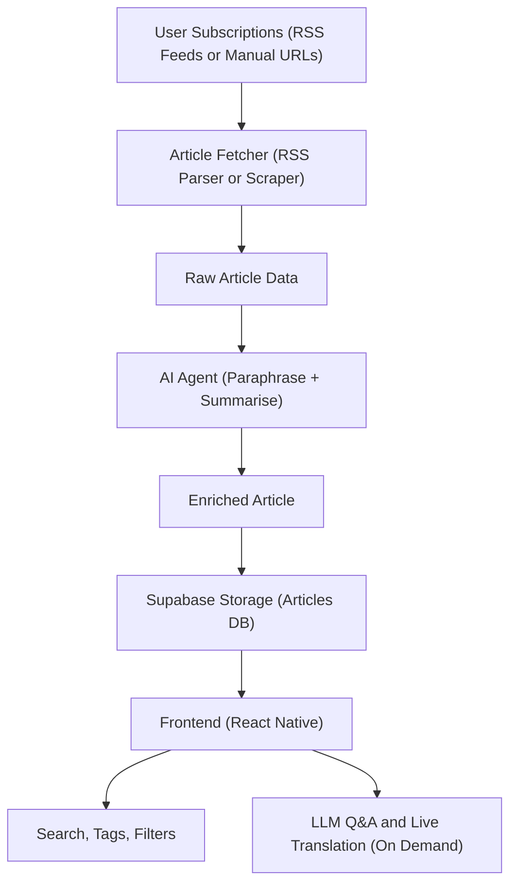

# Project Lumen 
> **Tagline:** Reimagine Reading. Reclaim your Focus.
> **Status:** Planning Phase  
> **Start Date:** September 2025 (Development Phase)  
> **Planning + Research Month:** August 2025
---
## Project Overview:

- Custom News Sources
Add RSS feeds or any publicly available websites. No limits.

- AI Summarisation & Enhancement
Each article is automatically paraphrased and summarised using open-source LLMs (via OpenRouter).

- Live Translation
Articles in other languages (e.g., German, French) are automatically translated into your preferred language.

- Ask Anything
Interact with articles using natural language questions with built-in LLM Q&A powered by agent chains (LangChain).

- Smart Feeds by Tags & Interests
Personalise your feed by topics, tags, or sources. Like or dislike articles to train your preferences.

- Provider-Level Search and Filters
Easily search articles from a specific source like The Verge, or mute sources you’re not interested in.

- Offline Saving & Reader Mode
Save any article for later. Read distraction-free in beautiful reader view.

- 100% Free & Open Source
No paywalls. No ads. No tracking

> This project will be built entirely using JavaScript—Node.js backend and React Native frontend—and will utilise Supabase as the full backend stack.

Lumen will be 100% free to use, open-source, and community-driven. Summarisation will be powered by freely available models such as [kimi-k2](https://openrouter.ai/moonshotai/kimi-k2:free)  for Q/A regarding the Articles and [gemma-3n](https://openrouter.ai/google/gemma-3n-e2b-it:free) & [deepseek-chat-v3](https://openrouter.ai/deepseek/deepseek-chat-v3-0324:free) for Article translations and paraphrasing, and summarisations to maintain both cost-effectiveness and openness.

---

## Tech Stack

|Component|Stack|
|---|---|
|**Frontend**|React Native (with Expo)|
|**Backend**|Node.js (Supabase Edge Functions + Serverless APIs)|
|**Database**|Supabase (PostgreSQL)|
|**Authentication**|Supabase Auth (Google, email, etc.)|
|**Storage**|Supabase Storage (for images, etc.)|
|**Translation API**|LibreTranslate (default), OpenAI Whisper (optional)|
|**Summarization**|OpenRouter models (e.g., Horizon-alpha), node-summarizer (fallback)|
|**LLM Search**|RAG-style prompt to GPT API (optional, later phase)|

---
## Core Features

### News Feed

- Chronological + Personalised views
- Multiple feed types:
    - All Articles
    - By Tags (e.g., AI, India, Tech)
    - By Provider (e.g., The Verge)
    - Liked Articles
    - Saved for Later
- Tag chips at the top of the feed for quick filtering
### Add News Providers

- Add by entering URL → detect RSS or use HTML selectors.
- Automatically extract articles (title, date, image, snippet)

### AI Features

- **Summarization**:
    - Default extractive summary (3–5 lines)
    - Open-source AI summary (e.g., Horizon-alpha via OpenRouter)
- **Translation**:
    - Automatically translates foreign articles into English.
    - Shows translated version in feed, with a toggle to view the original
- **LLM Q&A**:
    - Ask questions about the article (e.g., "What is the background of this event?")
    - Powered by free models available via [OpenRouter](https://openrouter.ai/)
    - Built using an intelligent multi-agent chain powered by **LangChain** for task handling, fact-checking, and context reasoning
    - Ask questions about the article (e.g., "What is the background of this event?")

###  Personalization

- Users can:
    - Add tags to articles.
    - Like or dislike articles (influences future feed)
    - Save/bookmark articles.
    - Follow tags/topics or providers
    - Search articles by provider name, tag, or keyword

---

##  Supabase Database Architecture (PostgreSQL)

| Function                  | Supabase Service                                             |
| ------------------------- | ------------------------------------------------------------ |
| DB                        | PostgreSQL with RLS                                          |
| Auth                      | Supabase Auth (OAuth + email)                                |
| Storage                   | Supabase Bucket for article images                           |
| API                       | Supabase Edge Functions                                      |
| Translation/Summary Cache | Stored in JSONB or `translations`/`summaries` tables         |
| Personalization           | `user_preferences`, `user_tags`, `user_subscriptions` tables |

---
## Lumen Ingestion Architecture:

---

## Key Principles:

- Learning-focused: great JS practice for full-stack architecture
- Modular: start with manual tags, add auto-tagging/AI later
- Compliant: ethically sound summarisation and scraping model
- AI-Ready: vector DB (`pgvector`), RAG pipelines possible later

## Ideal For
- Students and researchers who are overwhelmed by cluttered news apps.
- Indie developers looking to fork & customise their own reader.
- Anyone who wants a calm, focused, and intelligent reading experience.

## Coming Soon
- Bookmark sync with GitHub Gists or Drive
- OPML import/export
- Weekly email digests
- Offline caching

## License
MIT License. Use it, fork it, remix it — just give credit.

